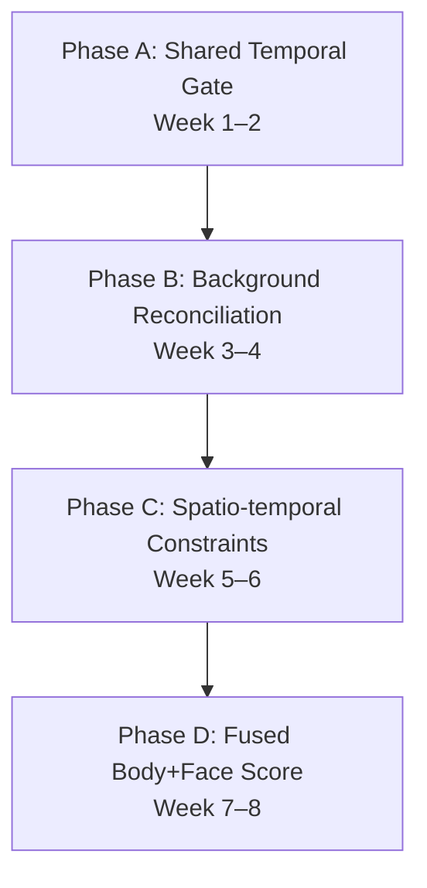

# Restaurant Visitor Tracker — Optimization & Accuracy Plan v2

> **Deep-audit edition.** Every `.py` file under `backend/app/` was read line-by-line.
> This document supersedes `OPTIMIZATION_AND_ACCURACY_PLAN.md` with exact line numbers,
> root-cause analysis for every duplicate-person bug, dead-code inventory, memory-leak
> findings, and a prioritized implementation roadmap.
>
> **Scope:** accuracy, throughput, multi-camera behaviour, code maintainability, memory safety.  
> **Out of scope:** deployment/operations (see `RESTAURANT_TRACKER_PRODUCTION_DEPLOYMENT_PLAN.md`).

**Last updated:** 2026-06-17

---

## Table of Contents

1. [Executive Summary](#1-executive-summary)
2. [Critical Bugs & Dead Code](#2-critical-bugs--dead-code)
3. [Why the Same Person Gets Multiple IDs — Root Cause Analysis](#3-why-the-same-person-gets-multiple-ids--root-cause-analysis)
4. [Duplicate & Redundant Code Audit](#4-duplicate--redundant-code-audit)
5. [Performance Bottlenecks](#5-performance-bottlenecks)
6. [Memory Management Issues](#6-memory-management-issues)
7. [Camera Service Architecture Problems](#7-camera-service-architecture-problems)
8. [Cross-Camera Identity Resolution Gaps](#8-cross-camera-identity-resolution-gaps)
9. [Best Optimization Opportunities — Ranked](#9-best-optimization-opportunities--ranked)
10. [Staged Implementation Roadmap](#10-staged-implementation-roadmap)
11. [Validation & Metrics](#11-validation--metrics)
12. [Files Most Likely to Change](#12-files-most-likely-to-change)
13. [Open Questions](#13-open-questions)

---

## 1. Executive Summary

The current pipeline is well-engineered — single-pass ArcFace, pose-aware HNSW,
temporal gates, ambiguity margins, cascade body skip, and frame de-duplication are
all solid foundations. However, a line-by-line audit uncovered **5 critical logic
bugs**, **4 dead-code features that were never integrated**, **1 memory leak**, and
**8 systematic accuracy failures** that cause the same person to fragment into
multiple visitor records, especially across camera angles.

### Top 5 Issues by Impact

| # | Issue | Impact | Section |
|---|-------|--------|---------|
| 1 | **Ambiguity gate fires on same-visitor gallery entries** | Correct matches marked AMBIGUOUS → person re-registered as new | §3.1 |
| 2 | **Grey-zone-to-new escalation is too aggressive** | Any grey-zone face with decent det_score → NEW visitor | §3.5 |
| 3 | **`FaceEmbeddingCache` has no eviction** — unbounded memory growth | OOM crash after hours of streaming | §6.1 |
| 4 | **No cross-camera identity linking** — each camera resolves independently | Person walking between cameras always gets duplicate ID | §8 |
| 5 | **Single-frame registration** — one bad angle creates a permanent visitor | High fragmentation rate in crowded/dynamic scenes | §3.4 |

### Dead Code Inventory

| Feature | File | Status |
|---------|------|--------|
| Cascade pipeline (skip OSNet when face strong) | `cascade_pipeline.py` | Defined but **never called** by `camera_service.py` |
| Group-frame detection (`_is_group_frame`) | `cv_pipeline.py` L38–49 | Computed but **never checked** in `detection_pipeline.py` |
| Face preprocessing (`preprocess_face_for_recognition`) | `utils.py` L289–304 | Defined but **never called** — face embeddings use raw images |
| Periocular re-embedding (`extract_periocular_region`) | `mask_detector.py` L66–80 | Defined but **never called** when mask detected |
| `_lower_face_brightness()` result | `mask_detector.py` L49 | Computed but **never used** in mask decision logic |
| `REJECT_SIMILARITY` config | `config.py` L32 | Defined (0.35) but **never referenced** in identity_resolver |
| `visit_confidence` field | `auto_enroller.py` L111 | Set to 0.3 at registration but **never updated or read** |
| `flag_ambiguous_visitor()` | `review_queue.py` L71–77 | Defined but **never called** |
| `flag_opted_out_match()` | `review_queue.py` L80–87 | Defined but **never called** |

---

## 2. Critical Bugs & Dead Code

### 2.1 Cascade pipeline is dead code

**Location:** `cascade_pipeline.py` (entire file, ~75 lines)

`process_frame_cascade()` implements a two-pass strategy: face detection first, then
OSNet only for weak/missing faces — documented as saving 30–40% CPU. However,
`camera_service.py` always calls `cv_pipeline.process_frame()` directly (L342 in
parallel worker, L540 in sequential loop). The cascade is **never invoked**.

```
camera_service.py L342:  detections = await run_in_threadpool(process_frame, frame, ...)
                         ^^^^^^^^^^^^^^^^^^^^^^^^^^^^^^^^^^^^^^^^^^^^^^^^^^^^^^^^^^^
                         Always calls process_frame, never process_frame_cascade
```

> [!WARNING]
> **Fix:** Wire `process_frame_cascade()` into the camera service, gated behind a
> `PIPELINE_CASCADE=True` setting.

### 2.2 Ambiguity gate fires on same-visitor gallery entries

**Location:** `identity_resolver.py` `_decide_from_face()` (~L161–165)

The ambiguity gate checks `top_sim − runner_up_sim < AMBIGUITY_MARGIN`. But when
the top-2 matches both belong to the **same visitor** (two different gallery faces
of one person), the gate fires incorrectly:

```
Example:
  top_match:    visitor_id=42, gallery_face_A, sim=0.58
  runner_up:    visitor_id=42, gallery_face_B, sim=0.54
  gap = 0.04 < AMBIGUITY_MARGIN (0.05)
  → Decision: AMBIGUOUS ❌  (should be RETURNING)
```

**Nuance:** The code at L163 *does* check `runner_up[0] != top_id` to skip same-visitor
comparisons — but this means if both top-2 are same visitor, the ambiguity gate is
**bypassed entirely and no runner-up comparison is made**. This means the *actual*
closest **different** visitor is never checked for ambiguity. Either way the logic
has a gap.

> [!IMPORTANT]
> **Fix:** When top-2 belong to the same visitor, treat as RETURNING. Additionally,
> compare the top match against the best match from a *different* visitor (may need
> top-3 from SQL).

```python
# In _decide_from_face():
if top.visitor_id == runner_up.visitor_id:
    # Both matches are the same person — not ambiguous
    return "RETURNING", top.visitor_id, top.similarity
```

### 2.3 `_is_group_frame()` computed but never used

**Location:** `cv_pipeline.py` L38–49

The function flags crowded frames (≥3 persons with high pairwise IoU). It returns a
boolean in the result dict, but `detection_pipeline.py` never checks it to suppress
new registrations in crowded scenes. Additionally, the pairwise IoU is O(N²).

### 2.4 Periocular embedding is dead code

**Location:** `mask_detector.py` L66–80, `detection_pipeline.py`

`is_masked()` detects a mask, but the detection pipeline **only adjusts the threshold
offset** (−0.05). It never calls `extract_periocular_region()` or re-runs face
embedding on the eye-region crop. The periocular function exists but is unused.

> [!WARNING]
> **Fix:** When `_is_masked()` returns True, call `extract_periocular_region(face_crop)`,
> re-run `ModelManager.extract_face_data()`, and use the periocular embedding with
> the masked threshold offset.

### 2.5 `preprocess_face_for_recognition()` never called

**Location:** `utils.py` L289–304

This function applies gamma + CLAHE before recognition. It is defined but **no code
path calls it**. Face embeddings are extracted from raw, unpreprocessed images. The
`preprocess_face()` function at L32–60 (CLAHE + auto-gamma) is also never called in
the recognition pipeline — only for thumbnail display.

> [!NOTE]
> **Impact:** Recognition accuracy in poor lighting suffers because the documented
> CLAHE+gamma preprocessing is not actually happening.

### 2.6 Config constants shadowed by hardcoded module-level values

**Location:** `auto_enroller.py` L133–134 vs `config.py` L215–216

```python
# auto_enroller.py (HARDCODED — actually used)
_MIN_PER_BIN = 2
_MAX_PER_BIN = 4

# config.py (DEAD — never read by auto_enroller)
MIN_FACES_PER_POSE_BIN: int = 2
MAX_FACES_PER_POSE_BIN: int = 4
```

Changing `config.py` values or runtime settings has **no effect** on gallery eviction
because `auto_enroller.py` reads its own constants.

### 2.7 `_lower_face_brightness()` result is computed but unused

**Location:** `mask_detector.py` L49, L52–56

```python
lower_bright = _lower_face_brightness(face_crop)   # L49 — computed
# L52–56: only lower_std and upper_std are checked
lower_is_flat = lower_std < 18.0
upper_has_texture = upper_std > 12.0
return lower_is_flat and upper_has_texture
# lower_bright is NEVER referenced in the decision
```

### 2.8 Review-queue flagging functions never called

- `flag_ambiguous_visitor()` (L71–77) — never called from `detection_pipeline.py`
- `flag_opted_out_match()` (L80–87) — never called; opted-out visitors are filtered
  in SQL but no flag is raised if they somehow match

---

## 3. Why the Same Person Gets Multiple IDs — Root Cause Analysis

### 3.1 Ambiguity gate suppresses correct matches (CRITICAL)

> See §2.2. When two gallery faces of the same visitor both score similarly, the
> ambiguity gate marks the detection AMBIGUOUS and drops it. The person is then
> re-detected on the next frame and — if only one gallery face matches well — may
> create a new visitor record.

**Frequency:** Happens often for visitors with diverse galleries (multiple pose bins),
which is exactly the population that needs the most robust matching.

### 3.2 Pose-bin granularity is too coarse

**Location:** `cv_pipeline.py` `estimate_pose()` (~L312–340)

Current bins: `frontal` (−15°..+15°), `left` (<−15°), `right` (>+15°), `down`, `unknown`.

A face at +30° yaw and +75° yaw are both `right`, but ArcFace embeddings differ
significantly across that range. The pose-aware gallery search preferentially matches
the same bin, but cannot interpolate confidence by actual yaw/pitch.

**Worse:** `estimate_pose()` computes continuous yaw/pitch/roll floats but **returns
only the string bin label**. The continuous values are discarded. The `visitor_faces`
table has no `yaw`/`pitch`/`roll` columns.

```
estimate_pose() → returns "right"   # yaw = 31.2° → LOST
estimate_pose() → returns "right"   # yaw = 74.8° → LOST
```

### 3.3 Thresholds are global constants

| Threshold | Value | Problem |
|-----------|-------|---------|
| `RETURNING_FACE_THRESHOLD` | 0.55 | Too high for visitors with high within-person variance |
| `NEW_VISITOR_MAX_SIMILARITY` | 0.45 | Grey zone is only 0.10 wide (0.45–0.55) |
| `AMBIGUITY_MARGIN` | 0.05 | Fires on legitimate same-person gallery variation |
| `REJECT_SIMILARITY` | 0.35 | Defined but **never used** — intended two-tier rejection collapsed |

> [!IMPORTANT]
> The grey zone between `NEW_VISITOR_MAX_SIMILARITY` (0.45) and
> `RETURNING_FACE_THRESHOLD` (0.55) is only **0.10 wide**. ArcFace documentation
> states same-person similarity is typically 0.5–0.7 — this means legitimate
> same-person matches at 0.50 fall squarely in the grey zone.

### 3.4 Single-frame registration — no temporal smoothing

**Location:** `detection_pipeline.py` `process_detections()`

Every frame makes an independent NEW / RETURNING / AMBIGUOUS decision. A single weak
frame can create a new visitor record even when surrounding frames correctly identify
the person.

```
Frame N-1:  Person detected → RETURNING (visitor_42) ✓
Frame N:    Head turned → sim=0.44 < 0.45 → NEW (visitor_87) ✗  ← DUPLICATE!
Frame N+1:  Head back → RETURNING (visitor_42) ✓
```

### 3.5 Grey-zone-to-new escalation is too aggressive (CRITICAL)

**Location:** `identity_resolver.py` L230–237 → `detection_pipeline.py`

```python
# resolve_batch() L230–237:
if res.match_source == "none" and not res.is_ambiguous:
    if face.get("det_score", 0.0) >= settings.FACE_QUALITY_CUTOFF:
        res = ResolutionResult(is_new=True, ...)
```

Any detection in the grey zone (similarity between 0.45 and 0.55) with
`det_score >= 0.45` is **automatically promoted to NEW**. This is the **#1
fragmentation vector**: a returning visitor whose face happens to score 0.50
similarity (different angle, lighting) gets a new visitor record created.

The code doesn't use the `REJECT_SIMILARITY` threshold it was supposed to
implement, nor does it consider how close the similarity is to the returning
threshold.

> [!CAUTION]
> **This is the single most damaging accuracy bug in the codebase.** Every person
> whose face match falls in the 0.45–0.55 range with a clear face (det_score ≥ 0.45)
> will be registered as a new visitor.

### 3.6 Gallery seeds from first detection only

**Location:** `auto_enroller.py` `register_new_visitor()` (~L94–129)

A new visitor is created from the very first face seen. If that first face is a bad
angle, partially occluded, motion-blurred, or low-quality, the centroid starts biased.

### 3.7 Centroid never updated on medium-confidence matches

**Location:** `auto_enroller.py` `update_after_match()` L359–365

For medium-confidence returning matches (0.55–0.65), the centroid is **NOT** updated
(centroid update is only inside the `>= STRONG_MATCH_THRESHOLD` branch at L357).

A visitor who consistently appears at medium confidence (e.g., always wearing glasses,
always at an angle) will have a stale centroid that drifts further from their actual
appearance → eventually causes fragmentation.

### 3.8 Masked-face grey zone collapses to 0.05

**Location:** `config.py` L220

The masked threshold offset is −0.05, lowering `RETURNING_FACE_THRESHOLD` from 0.55
to 0.50. But `NEW_VISITOR_MAX_SIMILARITY` (0.45) is **NOT adjusted** for masks.

The grey zone for masked faces shrinks from 0.10 to **0.05** — extremely narrow.
A masked person in this tiny zone gets fragmented.

### 3.9 No within-batch deduplication

**Location:** `identity_resolver.py` `resolve_batch()`

If the same frame contains two detections of the same person (e.g., overlapping YOLO
boxes), both go through resolution independently. Both could be classified as "new"
and trigger `register_new_visitor()`, creating **two visitor records from one frame**.

### 3.10 Temporal gate match doesn't update visitor gallery

**Location:** `detection_pipeline.py` L146–153

When the temporal gate redirects a "new" detection to a returning visitor, the code
fetches the visitor but does **NOT** call `update_after_match()`. The visitor's body
embedding, centroid, and gallery are not improved with this sighting.

---

## 4. Duplicate & Redundant Code Audit

### 4.1 Bbox clamping — 6 copy-paste sites

The exact pattern `x1 = max(0, min(w, int(bbox["x1"])))` is repeated in:

| # | File | Location | Context |
|---|------|----------|---------|
| 1 | `cv_pipeline.py` | L225–226 | `process_frame` person crop |
| 2 | `cv_pipeline.py` | L153–154 | `refine_small_face` margin crop |
| 3 | `camera_service.py` | L363–366 | `_roi_crop()` |
| 4 | `camera_service.py` | L451–454 | `_draw_roi_overlay()` |
| 5 | `cascade_pipeline.py` | L62–65 | Body crop |
| 6 | `detection_pipeline.py` | L65–68 | Safe crop |

**Fix:** Create `utils/geometry.py`:

```python
def clamp_bbox(bbox: dict, w: int, h: int) -> dict: ...
def crop_from_frame(frame, bbox, margin=0.0, min_size=4): ...
def box_iou(a, b) -> float: ...
def box_center(bbox) -> tuple[int, int]: ...
def offset_bbox(bbox, dx, dy) -> dict: ...
```

### 4.2 Bbox offset/translation — 3 sites

| # | File | Location |
|---|------|----------|
| 1 | `cv_pipeline.py` | L267–272 (fallback face bbox) |
| 2 | `cv_pipeline.py` | L171–176 (refined small face bbox) |
| 3 | `camera_service.py` | L373–384 (`_offset_detections()`) |

### 4.3 L2 normalization — 3 implementations, inconsistent return types

| # | File | Returns | Issue |
|---|------|---------|-------|
| 1 | `utils.py` L189–195 | `List[float]` | `.tolist()` — **expensive**, converts 512-d numpy to Python list |
| 2 | `ml_models.py` L394–396 | `np.ndarray` | Inline in `_extract_all_faces_cached()` |
| 3 | `ml_models.py` L437–439 | `np.ndarray` | Inline in `extract_body_embeddings()` |

**Then `cv_pipeline.py` calls `normalize_embedding()` again on already-normalized data.** Double normalization is mathematically harmless but wastes CPU + the `.tolist()` conversion.

### 4.4 Cosine similarity — 3 different approaches

| File | Method |
|------|--------|
| `identity_resolver.py` | `1 - (embedding <=> query)` via pgvector SQL |
| `temporal_consistency.py` L27–33 | Full norm computation (redundant for unit vectors) |
| `auto_enroller.py` L323 | `np.dot()` (assumes normalized) |

### 4.5 Frame de-duplication — 2 implementations

| # | File | Context |
|---|------|---------|
| 1 | `camera_service.py` L610–650 | Live camera streams |
| 2 | `api/detect.py` | Uploaded video files |

### 4.6 Visit state machine — fully duplicated

`visit_tracker.py` (~200 lines) and `redis_visit_tracker.py` (~220 lines) implement
the **identical** visit session lifecycle. The duration calculation
`max(0, int((left_at - started_at).total_seconds() // 60))` appears **4 times**
across both files. The close/update SQL statements are near-identical.

### 4.7 Mask detector — lower-face crop duplicated

| Function | Lines | Operation |
|----------|-------|-----------|
| `_lower_face_brightness()` | L17–22 | `face_crop[int(h*0.6):]` → gray → mean |
| `_lower_std()` | L59–63 | `face_crop[int(h*0.6):]` → gray → std |

Both extract the lower 40% and convert to grayscale independently. Should be one
helper returning both mean and std.

### 4.8 Thumbnail/crop save — nearly identical

`_save_thumbnail()` and `_save_face_crop()` in `auto_enroller.py` repeat the same
mkdir + path + `cv2.imwrite` + error handling pattern.

### 4.9 Face crop extracted twice per detection

**Location:** `detection_pipeline.py` L93 and L113

```python
face_crop = _crop(frame, d.face_bbox or d.bbox)   # L93 — pre-loop, result DISCARDED
face_crop = _crop(frame, det.face_bbox or det.bbox) # L113 — main loop, same crop recomputed
```

### 4.10 Camera service — parallel vs. sequential duplication

~300 lines of near-duplicate logic:

| Duplicated concern | Parallel location | Sequential location |
|--------------------|-------------------|---------------------|
| Detection processing + DB write | L414–426 | L554–566 |
| Annotation dict construction | L435–438 | L574–577 |
| `frame.copy()` on no-annotation | L296 | L579 |
| File source detection | L184–186 | L609 |

### 4.11 Resolve-flag function — duplicated

Both `review_queue.py:resolve_flag()` and `admin.py:resolve_review_flag()` exist.
The admin route may bypass service-layer validation.

---

## 5. Performance Bottlenecks

### 5.1 Triple ArcFace inference per frame (worst case)

**Location:** `cv_pipeline.py`

A single frame can trigger up to **3 levels** of ArcFace calls:

```
Level 1: extract_all_faces(full_frame)                    → L207 (always runs)
Level 2: refine_small_face(face_crop) per failed face     → L213 (per low-quality face)
Level 3: extract_face_data(person_crop) per faceless body → L254 (per person with no face)
```

In a crowded scene with 8 people, 3 small faces, and 2 body-only detections:
1 full-frame + 3 rescue + 2 fallback = **6 ArcFace inferences**.

**Fix:** Batch rescue passes. Collect all failed-quality crops, upscale, run one batched call.

### 5.2 YOLO box extraction uses per-box `.cpu().numpy()`

**Location:** `ml_models.py` L305–306

```python
for box in result.boxes:
    x1, y1, x2, y2 = box.xyxy[0].cpu().numpy().astype(int)  # GPU→CPU per box
    conf = float(box.conf[0].cpu().numpy())                    # GPU→CPU per box
```

**Fix:** Move entire tensors to CPU once outside the loop:
```python
boxes_np = result.boxes.xyxy.cpu().numpy().astype(int)
confs_np = result.boxes.conf.cpu().numpy()
```

### 5.3 Gamma LUT rebuilt on every call

**Location:** `utils.py` L267–286

`apply_gamma_correction()` creates a 256-entry lookup table on every invocation.
Auto-gamma also runs redundant `cvtColor(COLOR_BGR2GRAY)` since CLAHE already
converts to LAB.

**Fix:** Cache LUT by gamma value.

### 5.4 CLAHE object created every call

**Location:** `utils.py` L251–264

`cv2.createCLAHE()` allocates memory on every invocation. Should be a module-level
singleton and reused.

### 5.5 OSNet preprocessing is serialized

**Location:** `ml_models.py` L419–428

Each person crop is individually resized, color-converted, and normalized in a
Python list comprehension before `np.stack()`. Also duplicated with
`cascade_pipeline.py` L58–66 which manually resizes crops before calling OSNet.

### 5.6 Three copies of body embedding batch in memory

**Location:** `ml_models.py` L419–429

```python
batch = np.stack([...])                       # Copy 1: (N, 256, 128, 3)
batch = batch.transpose(...)                  # Copy 2: (N, 3, 256, 128)
tensor = torch.from_numpy(batch).to(device)   # Copy 3 (if GPU)
```

### 5.7 Live preview JPEG encoding is unconditional

**Location:** `camera_service.py` L300–302

`cv2.imencode` runs at `LIVE_PREVIEW_FPS` (15fps) regardless of whether anyone is
watching. Combined with `frame.copy()` at L296, wastes ~15ms/frame CPU.

### 5.8 Frame dedup on wrong crop in sequential mode

**Location:** `camera_service.py` L530

Sequential `_processing_loop()` calls `frame_signature(frame)` on the **full frame**,
not the ROI crop. May skip/pass frames based on motion *outside* the ROI.

The parallel pipeline (L333) correctly uses the ROI-cropped area.

### 5.9 `extract_face_data()` runs full multi-face detection, discards all but one

**Location:** `ml_models.py` L323–333

When used as the per-crop fallback in `cv_pipeline.py` L254, it runs full multi-face
detection on a single-person crop, then picks `max(faces, key=det_score)`, discarding
the rest. Wasted computation.

---

## 6. Memory Management Issues

### 6.1 FaceEmbeddingCache — unbounded memory leak (CRITICAL)

**Location:** `ml_models.py` L25–47

`FaceEmbeddingCache._store` is a plain `dict[int, np.ndarray]` with **no eviction
policy** — no max size, no TTL, no LRU.

| Duration | Faces cached | Memory |
|----------|-------------|--------|
| 1 hour | ~3,600 | ~7 MB |
| 24 hours | ~86,400 | ~170 MB |
| 7 days | ~604,800 | **~1.2 GB** |

> [!CAUTION]
> For a 24/7 deployment, this is a memory leak that **will** cause OOM. Fix with
> `collections.OrderedDict` + max-size eviction (e.g. 10,000 entries ≈ 20 MB).

### 6.2 Video frames loaded entirely into memory

**Location:** `utils.py` L70–109

`_extract_video_frames_from_path()` appends ALL extracted frames to a list.
For a 60s video at 30fps at 1280px: ~1800 frames × ~5 MB = ~9 GB.

**Fix:** Yield frames as a generator.

### 6.3 `frame.copy()` churn in display loop

**Location:** `camera_service.py` L296

`draw_detections()` already returns a copy. When no annotations, L296 does another
`frame.copy()` at 15fps — ~30 MB/s allocation churn.

### 6.4 ModelManager singleton holds all models forever

**Location:** `ml_models.py` L98–118

No OOM protection or memory monitoring. `reload()` sets models to None and calls
`torch.cuda.empty_cache()` but Python GC may not immediately free CUDA memory.

### 6.5 Three copies of body embedding batch

Already noted in §5.6 — `np.stack` + `transpose` + `torch.from_numpy` creates three
copies of (N, 256, 128, 3) float32 tensors momentarily.

---

## 7. Camera Service Architecture Problems

### 7.1 Two entirely separate code paths (~300 lines duplicated)

Sequential `_processing_loop()` and parallel pipeline share the same class but
duplicate: detection processing, DB writes, annotation construction, frame dedup,
JPEG encoding, and source detection.

**Fix:** Extract a shared `FrameProcessor` that both paths use.

### 7.2 Shared mutable state without synchronization

| State | Written by | Read by | Protected? |
|-------|-----------|---------|------------|
| `self._last_sig` | `_inference_worker()` L334 | `_inference_worker()` L338 | ❌ No lock |
| `self._last_annotations` | `_consumer_loop()` L435 | `_display_loop()` L295 | ❌ No lock |
| `self.stats` dict | Multiple coroutines | Multiple coroutines | ❌ No lock |

### 7.3 Thundering-herd wake in `_claim_latest()`

**Location:** `camera_service.py` L261–271

`notify_all()` wakes ALL inference workers, but only one claims the frame.

**Fix:** Use `notify(1)` or `asyncio.Queue`.

### 7.4 No RTSP reconnection logic

**Location:** `camera_service.py` L236–238

Dead RTSP connection retries `capture.read()` forever without releasing and
re-establishing the TCP connection.

**Fix:** Add reconnection with exponential backoff.

### 7.5 Video pacing drift

Uses `asyncio.sleep(1/fps)` — doesn't account for processing time.

**Fix:** Wall-clock target: `sleep(max(0, target - time.monotonic()))`.

### 7.6 Singleton pattern without thread safety

`CameraService.get_instance()`, `ModelManager._instance`, `VisitTracker._instance`
all use `cls._instance is None` without locks. While asyncio is single-threaded on
the event loop, inference runs in thread pools.

---

## 8. Cross-Camera Identity Resolution Gaps

### 8.1 Each camera resolves independently

`identity_resolver.py` receives `camera_id` but only uses it for logging/events.
No reconciliation layer exists. A person walking from Camera-1 to Camera-2 is
registered twice.

### 8.2 Temporal gate is per-process, not cross-camera

`TemporalConsistencyGate` is a module-level singleton with no `camera_id` field
in its entries (L64–72). Camera-A detections are invisible to Camera-B's gate.

### 8.3 Pixel distance is camera-specific

`TEMPORAL_MAX_PIXEL_DISTANCE` (150px) is absolute in frame coordinates. Different
cameras with different resolutions/FOVs make 150px mean completely different
physical distances.

### 8.4 `camera_id` stored but never used for identity decisions

`camera_id` is passed through `detection_pipeline.py` and stored on
`DetectionEvent`, but never consulted during resolution, gallery search, or
temporal matching.

### 8.5 No `camera_id` on `visitor_faces`

Can't tell which camera captured a gallery face — needed for cross-camera analysis.

### 8.6 Merge doesn't clean temporal gate

After `merge_visitors()` deletes the source visitor, the temporal gate still has
entries under the source's `visitor_id`. New detections could match against a
now-deleted visitor.

### 8.7 Cross-Camera Resolution Roadmap



#### Phase A — Shared temporal gate (Week 1–2)
Make `TemporalConsistencyGate` shared across cameras (Redis pub/sub or shared memory).
When Camera-B sees a "new" face, check recent detections from ALL cameras. Replace
pixel distance with a camera-aware proximity check.

#### Phase B — Background reconciliation job (Week 3–4)
```
Every 5 minutes:
  For each visitor V seen on camera A in last T minutes:
    Search V's centroid against visitors seen on camera B
    If top_sim >= CROSS_CAMERA_MERGE_THRESHOLD (0.60):
       Queue for operator review (or auto-merge if >= 0.70)
```

#### Phase C — Spatio-temporal constraints (Week 5–6)
```python
camera_transitions = {
    ("entrance", "dining"): 10,   # min 10 seconds walk
    ("entrance", "bar"): 15,
    ("dining", "bar"): 8,
}

if camera_a != camera_b and time_delta < min_walk_time(a, b):
    candidate_score *= 0.5   # penalize impossible transitions
```

#### Phase D — Fused body+face score (Week 7–8)
- Extract dominant upper/lower body colours from person crop.
- Cross-camera score: `face_sim × 0.6 + body_sim × 0.2 + colour_sim × 0.2`.
- Body/colour signals are same-session only; face carries across days.

---

## 9. Best Optimization Opportunities — Ranked

### 9.1 Fix ambiguity gate (1-line fix, HIGHEST IMPACT)

```python
# identity_resolver.py _decide_from_face():
if top.visitor_id == runner_up.visitor_id:
    return "RETURNING", top.visitor_id, top.similarity
```

### 9.2 Fix grey-zone escalation logic

Replace the aggressive "grey zone + clear face → NEW" with a stricter gate:

```python
# Only promote to NEW if similarity is BELOW REJECT_SIMILARITY (0.35)
# Grey zone (0.35–0.55) → hold in buffer, do NOT create visitor
if top_sim <= settings.REJECT_SIMILARITY:
    res = ResolutionResult(is_new=True, ...)
elif top_sim <= settings.RETURNING_FACE_THRESHOLD:
    # Grey zone — buffer for tracklet, don't register yet
    res = ResolutionResult(is_new=False, match_source="grey_zone", ...)
```

### 9.3 Tracklet-based registration buffer

```
Frame N-1      Frame N        Frame N+1      Frame N+2
   │              │              │              │
   └──────────────┴──────────────┴──────────────┘
                        │
                        ▼
   Tracklet: {bbox trajectory, face embeddings[], poses[], quality[]}
                        │
                        ▼
   Aggregate: quality-weighted mean embedding
                        │
                        ▼
   Resolve ONCE → visitor_id
```

**Benefits:** One bad frame cannot create a duplicate. Multiple angles fuse into one
stronger embedding. Reduces DB round-trips.

**Requirements:** ≥2 face detections to create a new visitor. Existing returning
matches can still update per-frame.

### 9.4 Per-visitor adaptive thresholds

```python
# After each gallery update:
pairwise_sims = [cosine(g1, g2) for g1, g2 in combinations(gallery, 2)]
visitor.expected_match_sim = mean(pairwise_sims)
visitor.match_sim_std = std(pairwise_sims)
visitor.personal_threshold = max(0.40, min(0.70,
    visitor.expected_match_sim - 2 * visitor.match_sim_std))
```

**Schema:** Add `expected_match_similarity`, `match_similarity_std`,
`personal_threshold` to `visitors`.

### 9.5 Persist continuous pose values

Return and store continuous yaw/pitch/roll from `estimate_pose()`:

```sql
ALTER TABLE visitor_faces ADD COLUMN yaw FLOAT;
ALTER TABLE visitor_faces ADD COLUMN pitch FLOAT;
ALTER TABLE visitor_faces ADD COLUMN roll FLOAT;
```

Update gallery search:
```sql
ORDER BY
  CASE WHEN ABS(vf.yaw - :yaw) < 15 THEN 1
       WHEN ABS(vf.yaw - :yaw) < 35 THEN 2
       ELSE 3 END,
  vf.embedding <=> :emb
```

### 9.6 Fix `FaceEmbeddingCache` — add LRU eviction

```python
from collections import OrderedDict

class FaceEmbeddingCache:
    def __init__(self, maxsize=10_000):
        self._store = OrderedDict()
        self._maxsize = maxsize

    def get(self, key):
        if key in self._store:
            self._store.move_to_end(key)
            return self._store[key]
        return None

    def put(self, key, value):
        self._store[key] = value
        self._store.move_to_end(key)
        while len(self._store) > self._maxsize:
            self._store.popitem(last=False)
```

### 9.7 Activate cascade pipeline

Wire into `camera_service.py`:
```python
if settings.PIPELINE_CASCADE:
    detections = await run_in_threadpool(process_frame_cascade, frame, ...)
else:
    detections = await run_in_threadpool(process_frame, frame, ...)
```

### 9.8 Integrate face preprocessing into recognition

Call `preprocess_face()` (CLAHE + gamma) on face crops before embedding extraction.

### 9.9 Centroid pre-filter for gallery search

1. Compare query to every visitor's centroid in `visitors.face_embedding`.
2. Keep only candidates within loose radius (cosine ≥ 0.35).
3. Run HNSW on `visitor_faces` for those candidates only.

### 9.10 Merge safety improvements

| Problem | Fix |
|---------|-----|
| No merge validation | Re-verify gallery similarity before merge |
| Gallery overflow (10+10=20) | Run eviction after merge to trim to cap |
| No audit trail | Add `merge_audit_log` table |
| `auto_merge_duplicates` uses stale similarity | Re-compute against current gallery |
| Cascading merges (A→B, B→C) | Detect and prevent in loop |
| Non-atomic batch merge | Wrap in single transaction |

---

## 10. Staged Implementation Roadmap

### Phase 1 — Critical Fixes & Quick Wins (Week 1–2)

| # | Task | Files | Impact |
|---|------|-------|--------|
| 1.1 | **Fix ambiguity gate** — same-visitor check | `identity_resolver.py` | Largest false-AMBIGUOUS fix |
| 1.2 | **Fix grey-zone escalation** — use `REJECT_SIMILARITY` | `identity_resolver.py` | Largest fragmentation fix |
| 1.3 | **Fix `FaceEmbeddingCache`** — LRU (maxsize=10000) | `ml_models.py` | Prevent OOM |
| 1.4 | **Activate cascade pipeline** | `camera_service.py` | 30–40% CPU savings |
| 1.5 | **Activate periocular re-embedding** | `detection_pipeline.py`, `mask_detector.py` | Masked-face accuracy |
| 1.6 | **Integrate face preprocessing** | `cv_pipeline.py` or `ml_models.py` | Low-light accuracy |
| 1.7 | **Fix YOLO per-box GPU→CPU** | `ml_models.py` | ~2× faster postprocessing |
| 1.8 | **Cache CLAHE + gamma LUT** | `utils.py` | Minor per-frame savings |
| 1.9 | **Add RTSP reconnection** | `camera_service.py` | Prevent dead camera loops |
| 1.10 | **Fix config shadow** — use settings for bin limits | `auto_enroller.py` | Config actually works |
| 1.11 | **Wire `flag_ambiguous_visitor()`** | `detection_pipeline.py` | Surface bad data |

### Phase 2 — Code Consolidation (Week 3–4)

| # | Task | Files |
|---|------|-------|
| 2.1 | **Create `geometry.py`** — consolidate 6 bbox call-sites | New file, refactor 6 call-sites |
| 2.2 | **Single normalization source** — models return normalized | `ml_models.py`, `cv_pipeline.py`, `utils.py` |
| 2.3 | **`FrameDedupBuffer` class** | `camera_service.py`, `api/detect.py` |
| 2.4 | **Abstract `VisitTrackerBackend`** | `visit_tracker.py`, `redis_visit_tracker.py` |
| 2.5 | **Merge parallel/sequential paths** | `camera_service.py` |
| 2.6 | **Fix sequential-mode ROI dedup** | `camera_service.py` L530 |
| 2.7 | **Deduplicate mask detector crops** | `mask_detector.py` |
| 2.8 | **Single cosine_similarity util** | `utils.py`, 3 call-sites |
| 2.9 | **Remove duplicate face-crop extraction** | `detection_pipeline.py` L93/L113 |

### Phase 3 — Accuracy Improvements (Week 5–8)

| # | Task | Files |
|---|------|-------|
| 3.1 | **Persist continuous pose** (yaw/pitch/roll) | `models.py`, `cv_pipeline.py`, `identity_resolver.py`, migration |
| 3.2 | **Per-visitor adaptive thresholds** | `models.py`, `auto_enroller.py`, `identity_resolver.py`, migration |
| 3.3 | **Tracklet buffer** (2–5 second window) | `detection_pipeline.py`, new `tracklet.py` |
| 3.4 | **Use `_is_group_frame()`** to suppress registration | `detection_pipeline.py` |
| 3.5 | **Gallery quality gating** | `auto_enroller.py` |
| 3.6 | **Merge safety** | `visitor_merge.py`, `review_queue.py`, migration |
| 3.7 | **Update centroid on medium-confidence matches** | `auto_enroller.py` |
| 3.8 | **Adjust `NEW_VISITOR_MAX_SIMILARITY` for masked faces** | `identity_resolver.py` |
| 3.9 | **Within-batch dedup** check | `identity_resolver.py` |
| 3.10 | **Temporal gate match → call `update_after_match()`** | `detection_pipeline.py` |

### Phase 4 — Cross-Camera & Scale (Week 9–12)

| # | Task | Files |
|---|------|-------|
| 4.1 | **Shared temporal gate** across cameras | `temporal_consistency.py` |
| 4.2 | **Cross-camera reconciliation job** | New `cross_camera_dedup.py` |
| 4.3 | **Camera transition model** | `models.py`, new `camera_topology.py` |
| 4.4 | **Add `camera_id` to `visitor_faces`** | `models.py`, migration |
| 4.5 | **Centroid pre-filter** | `identity_resolver.py` |
| 4.6 | **Bulk event writes** & visitor cache | `detection_pipeline.py` |
| 4.7 | **Lazy JPEG encoding** | `camera_service.py` |
| 4.8 | **Clean temporal gate after merge** | `visitor_merge.py` |

### Phase 5 — Advanced (Week 13+)

| # | Task | Impact |
|---|------|--------|
| 5.1 | **Model adapter** for AdaFace/MagFace | Better accuracy on hard faces |
| 5.2 | **TensorRT/OpenVINO** for all models | 2–3× inference speedup |
| 5.3 | **ByteTrack/DeepSORT integration** | Stable track IDs |
| 5.4 | **3D face normalization** | Reduce cross-angle variance |
| 5.5 | **Self-supervised gallery refinement** | DBSCAN to detect split identities |
| 5.6 | **Body+colour cross-camera re-ID** | Cross-camera without face |

---

## 11. Validation & Metrics

### Before/After Metrics (measure after each phase)

| Metric | How to compute | Target |
|--------|----------------|--------|
| **Duplicate rate** | `probable_duplicate` flags / total new visitors | ↓ 50%+ |
| **False-new rate** | New visitors with top gallery sim > 0.40 / total detections | ↓ |
| **Fragmentation rate** | Same labelled person with ≥2 `visitor_id`s | ↓ |
| **False-merge rate** | Different people with same `visitor_id` | Must stay ~0 |
| **Ambiguity suppression rate** | AMBIGUOUS decisions / total face decisions | ↓ after §9.1 |
| **Grey-zone-to-new rate** | Grey zone → NEW promotions / total grey zone | ↓ after §9.2 |
| **Cross-camera recall** | Same person re-ID'd on 2+ cameras / total seen on 2+ | ↑ |
| **p95 frame latency** | Capture → DB commit time | ↓ or stable |
| **Gallery size** | Mean/p95 `visitor_faces` rows per visitor | ≤ cap |
| **Memory (RSS)** | Process RSS over 24 hours | Stable (no growth) |
| **Cache hit rate** | dHash cache hits / total face lookups | ↑ |

### Labelling Requirement

To measure fragmentation/false-merge accurately, a small dataset of **manually
labelled multi-angle sequences** is needed (10–20 people, 3+ camera angles each,
~5 minutes per person). Until then, use review-queue proxies and top-similarity
distribution of new visitors.

### Automated Regression Test

After Phase 2, set up a CI job:
1. Play a standard test video through the pipeline.
2. Assert: ≤N new visitors created, ≤M AMBIGUOUS decisions.
3. Assert: memory RSS doesn't grow beyond baseline + 200 MB.
4. Assert: p95 latency ≤ 3 seconds.

---

## 12. Files Most Likely to Change

| File | Changes | Phase |
|------|---------|-------|
| `identity_resolver.py` | Ambiguity gate, grey-zone fix, pose search, adaptive thresholds, pre-filter, within-batch dedup | 1, 3, 4 |
| `auto_enroller.py` | Config shadow fix, per-visitor stats, gallery gating, centroid on medium matches, thumbnail consolidation | 1, 2, 3 |
| `ml_models.py` | Cache eviction, YOLO bulk transfer, normalization source, model adapter | 1, 2, 5 |
| `cv_pipeline.py` | Return continuous pose, integrate preprocessing, group-frame usage | 1, 3 |
| `camera_service.py` | Cascade wiring, RTSP reconnect, parallel/sequential merge, lazy JPEG, ROI dedup | 1, 2, 4 |
| `detection_pipeline.py` | Periocular path, tracklet buffer, group-frame gate, flag wiring, temporal match update, within-batch dedup, crop dedup | 1, 2, 3 |
| `utils.py` | CLAHE/gamma caching, geometry extraction, normalization cleanup | 1, 2 |
| `models.py` | yaw/pitch/roll, per-visitor threshold, camera_id on faces, merge log | 3, 4 |
| `visit_tracker.py` / `redis_visit_tracker.py` | Abstract base class refactor | 2 |
| `visitor_merge.py` | Safety checks, gallery trim, audit log, temporal gate cleanup | 3, 4 |
| `mask_detector.py` | Crop consolidation, periocular integration, brightness usage | 1, 2 |
| `temporal_consistency.py` | Cross-camera shared gate, camera-aware proximity | 4 |
| `review_queue.py` | Cross-camera flagging, resolve consolidation, atomic batch merge | 2, 4 |
| `config.py` | Validation ranges, PIPELINE_CASCADE setting | 1 |
| New: `utils/geometry.py` | Consolidated bbox helpers | 2 |
| New: `services/tracklet.py` | Tracklet buffer/tracker | 3 |
| New: `services/cross_camera_dedup.py` | Cross-camera reconciliation | 4 |
| New: `services/camera_topology.py` | Camera transition model | 4 |

---

## 13. Open Questions

1. **Single-camera or multi-camera deployment?** Determines urgency of Phase 4.
2. **Labelled evaluation data available?** Needed for fragmentation metrics.
3. **Latency budget?** Tracklets add 2–5 seconds before first registration.
4. **GPU in production?** Determines TensorRT vs OpenVINO priority.
5. **Auto-merge or operator-approved cross-camera merges?**
6. **Memory budget per camera?** Determines cache sizes.
7. **Is cascade pipeline (`cascade_pipeline.py`) intentionally disabled or forgotten?**
8. **Is `preprocess_face_for_recognition()` an abandoned feature or planned?**
9. **Why is `REJECT_SIMILARITY` defined but never used?** Was the two-tier rejection
   abandoned or is it a bug?
10. **Should medium-confidence matches update the centroid?** Current code only
    updates on strong matches (≥0.65), which may be too conservative.

---

*End of plan. This document should be treated as a living reference — update
the "Last updated" date and phase status as implementation progresses.*
